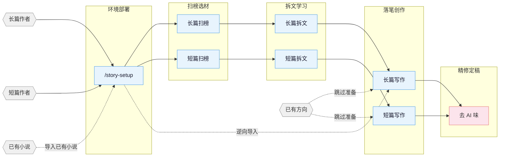

[English](README_EN.md) | **中文**

# oh-story

网文写作 skill 包，覆盖长篇与短篇网络小说的扫榜、拆文、写作、去AI味、封面图全流程。适配 Claude Code、OpenClaw、Codex，并通过项目化 `.oh-story-codex/` + `AGENTS.md` 约束 Trae SOLO / Cloud Agents 使用本地 skill。

## 当前增强

本仓库在上游 v0.6.8 基础上保留本地 fork 能力：

- **项目化部署**：`/story-setup` 会把当前 oh-story skill 包复制到写作项目根目录 `.oh-story-codex/`，并创建或合并 `AGENTS.md`。
- **Codex 原生子代理**：同步部署 `.codex/config.toml` 与 8 个 `.codex/agents/*.toml`，覆盖大纲、人设、正文、单章复审、一致性检查、资料研究、上下文查询和章节提取。
- **单章主编复审**：长篇单章写作与日更流程可调用 `chapter-editor`，在字数、基础检查、禁用词扫描后复审爽点、钩子、角色反应和连续性风险。
- **Trae SOLO / Cloud Agents 兼容**：`AGENTS.md` 提供 4 个核心写作子代理映射；不支持子代理的环境按主控串行流程执行。
- **上游 v0.6.8 合并**：包含 story-import 篇幅分流、角色状态反推、story-review Agent 参考路径修复、起点扫榜移动端 SSR 抓取等更新。

## 核心思路

> **套路 = 确定性的情绪满足**

专业作者的方法论三步走：

1. **扫榜**：分析热门榜单，洞察题材、人设、切入点。
2. **拆文**：拆解大纲节奏与剧情素材，建立个人模块库。
3. **商业化写作**：学习并运用钩子、爽感、期待感等核心技巧。

围绕四条线展开：爆款逆向 · 剧情模块化重组 · 上下文状态分层管理 · 人机协同。

## 流程总览



## 安装

**方式一** 直接告诉 Claude Code / OpenClaw：

```
安装这个 skill https://github.com/njacknot/oh-story
```

**方式二** 命令行：

```bash
npx skills add njacknot/oh-story -y -g
```

`-g` 全局安装，所有目录可用；去掉 `-g` 则只装到当前目录。更新时重新执行同一条命令即可。

> 升级后如果项目里已经跑过 `/story-setup`，建议在项目根重跑一次 `/story-setup`，同步 hooks / agents / references。每版变更见 [CHANGELOG.md](CHANGELOG.md) 与 [Releases](https://github.com/njacknot/oh-story/releases)。

## Skills

| Skill | 触发 | 说明 |
|:------|:-----|:-----|
| `story-setup` | `/story-setup` `/准备写书` | 环境部署 · `.oh-story-codex`/AGENTS.md/`.codex/agents`/hooks/rules/agents/CLAUDE.md 一键部署（已有配置安全合并） |
| `story` | `/story` `/网文` | 工具箱路由 · 模糊意图自动分发到对应 skill |
| `story-long-write` | `/story-long-write` `/写长篇` | 长篇写作 · 大纲搭建、人物设定、正文输出 |
| `story-long-analyze` | `/story-long-analyze` | 长篇拆文 · 黄金三章、爽点设计、节奏分析 |
| `story-long-scan` | `/story-long-scan` | 长篇扫榜 · 起点/番茄/晋江市场趋势 |
| `story-short-write` | `/story-short-write` | 短篇写作 · 情绪设计、反转构思、精修出稿 |
| `story-short-analyze` | `/story-short-analyze` | 短篇拆文 · 故事核、结构分析、情感线、反转设计、写作手法、共鸣分析 |
| `story-short-scan` | `/story-short-scan` | 短篇扫榜 · 知乎盐言/番茄短篇风口数据 |
| `story-deslop` | `/story-deslop` `/去AI味` | 去AI味 · 检测并清除 AI 写作痕迹 |
| `story-import` | `/story-import` `/导入小说` | 逆向导入 · 将已有小说反向解析为标准项目结构 |
| `story-review` | `/story-review` `/审查` | 多视角审查 · 4 Agent 多视角审稿 + 番茄/起点/知乎评分标准 |
| `story-cover` | `/story-cover` `/封面` | 封面生成 · 书名题材分析 + GPT-Image-2 出图 |
| `browser-cdp` | `/browser-cdp` | 浏览器操控 · CDP 协议复用登录态抓取数据 |

自然语言同样触发：
- 「帮我开书」→ `story-long-write`
- 「这篇太 AI 了」→ `story-deslop`
- 「把我的书导进来」→ `story-import`
- 「沈栀现在什么状态」→ 自动 spawn `story-explorer` agent

<details>
<summary>封面生成示例</summary>


</details>

<details>
<summary>拆文 demo — 盘龙</summary>

使用 `/story-long-analyze` 深度模式分析《盘龙》前23章的完整输出：

```
demo/拆文库-盘龙/
├── 概要.md              # 全书概要 + 章节索引
├── 拆文报告.md           # 五维评分 + 爽点密度 + 可借鉴套路
├── 文风.md              # 句长/标点/对话潜台词/情绪节奏 + 原文锚点
├── 章节/
│   ├── 第1章_深度拆解.md  # 黄金三章深度分析
│   └── 第1-23章_摘要.md   # 每章摘要 + 情节点 + 角色提及
├── 角色/
│   ├── 林雷.md           # 主角完整档案
│   ├── 霍格.md           # 核心配角
│   ├── 希尔曼.md         # 核心配角
│   ├── 德林柯沃特.md      # 核心配角
│   ├── 沃顿.md           # 功能角色
│   └── 角色关系.md        # 关系网络
├── 剧情/
│   └── 故事线.md          # 框架识别 + 4剧情 + 2故事线
└── 设定/
    ├── 世界观/
    │   ├── 背景设定.md    # 核心规则 + 特殊设定
    │   ├── 力量体系.md    # 战气 + 魔法 + 等级
    │   ├── 地理.md        # 安达卢西亚 + 玉兰大陆
    │   └── 金手指.md      # 盘龙戒指 + 德林柯沃特
    └── 势力/
        └── 巴鲁克家族.md  # 龙血血脉家族档案
```

长篇拆文会额外生成 `文风.md`；日更写作会读取它，避免对话、标点和情绪节奏偏离对标书。

</details>

## Agent 体系

写作 skill 内部通过 8 个专业 Agent 协作，各司其职：

| Agent | 模型 | 职责 |
|:------|:-----|:-----|
| **story-architect** | Opus | 故事架构 · 题材定位、大纲结构、钩子/反转设计、情绪弧线 |
| **character-designer** | Sonnet | 角色设计 · 角色档案、语言风格、动机链、对话创作 |
| **narrative-writer** | Sonnet | 叙事写手 · 正文写作、去AI味、格式合规 |
| **chapter-editor** | Sonnet | 单章主编 · 细纲完成度、爽点释放、读者体验、连续性风险总复审 |
| **consistency-checker** | Haiku | 一致性检查 · 事实冲突扫描、伏笔追踪、S1-S4 分级报告 |
| **story-researcher** | Sonnet | 资料研究 · CDP 搜索+正文提取、多源交叉验证、结构化参考文件输出 |
| **story-explorer** | Haiku | 故事查询 · 角色/伏笔/设定/进度只读查询，日更上下文快速加载 |
| **chapter-extractor** | Haiku | 章节提取 · 摘要+情节点+角色提及，并行拆文核心单元 |

Agent 按需加载 `references/` 中的写作理论（角色设计、对话技法、反转工具箱等 100+ 份方法论文件），不预占上下文。

### Trae SOLO / Cloud Agents 项目化

`/story-setup` 会把当前 oh-story skill 包复制到项目根目录 `.oh-story-codex/`，并生成 `AGENTS.md`。这样即使运行环境不能安装全局 skill，SOLO 或其他 Cloud Agents 也能按项目内的本地 skill 执行。

> 兼容性说明：仓库名已改为 `oh-story`，但项目内置目录仍保留 `.oh-story-codex/`，这是已部署项目和 AGENTS 托管区块的兼容锚点，不建议改名。

底层可执行脚本：`skills/story-setup/scripts/deploy-projectized.sh <项目根目录> [oh-story根目录]`。

Codex 原生适配会同步部署：

- `.codex/config.toml`：设置子代理并发上限与递归深度
- `.codex/agents/*.toml`：8 个 Codex 原生 story agent，与 Claude agent 名称保持一致

Trae SOLO 自定义子代理推荐映射：

Trae SOLO 需要在 Agent / SOLO Coder 配置入口手动创建、导入或勾选自定义智能体；`AGENTS.md` 只提供项目规则和角色说明，不会自动注册 Trae 子代理。若当前工作流只配置 4 个写作子代理，推荐如下：

| 建议自定义智能体 | 本地能力 | 职责 |
|:--|:--|:--|
| Story Architect | story-architect | 大纲、细纲、爽点、钩子、反转 |
| Character Director | character-designer | 角色、关系、动机、对话和 OOC |
| Narrative Writer | narrative-writer | 正文、场景展开、去 AI 味 |
| Chapter Editor | chapter-editor + 连续性检查清单 | 单章复审、读者体验、伏笔/时间线风险 |

## 升级到 v0.6.11 / fork v10

如果你已经在写作项目中运行过 `/story-setup`，升级 skill 后请在项目根目录重新运行一次 `/story-setup`。本 fork 的部署标记为 `agents_version` v10，包含 upstream v0.6.9-v0.6.11 的文风召回、拆文管线和可靠性修复，并额外部署项目化 skill 包、`chapter-editor` 和 Codex 原生子代理。

本版重点合并 upstream v0.6.9-v0.6.11，并保留 fork 的项目化与子代理能力：

- `/story-long-write 日更` 进入批量流程后，同一批次里的“继续 / 续写 / 日更”会继续留在 `workflow-daily.md`，不会跳出流程直接写正文。
- 每章开始前必须读取本轮真实项目文件：细纲、上一章正文、`追踪/上下文.md`、`追踪/伏笔.md`、`追踪/时间线.md`、角色状态/角色设定。
- SessionStart hook 只提示 `已过期` 或异常伏笔状态；正常开放伏笔（`未埋` / `已埋`）不再触发全量伏笔审计。
- 日更流程只处理本轮增量伏笔；需要全量审计时请显式运行 `/story-review`。
- **story-import（导入已有小说）**：按篇幅自动分流——长篇走完整拆解 + 长篇项目结构迁移，短篇走短篇拆解 + 单文件 `正文.md` 工程。判定优先级：用户声明 > 章节结构 > 字数兜底。
- **story-import**：长篇导入会反推 `追踪/角色状态.md`，story-long-write 日更准备层不再因为缺这个文件而走兜底分支。
- **story-import**：调用拆书 skill 时自动越过 Stage 1 停靠点，避免「黄金三章后停下询问」的交互被透传给导入用户。
- **story-review 子 Agent 路径修复**：reviewer 不再在用户项目 cwd 下查 `quality-checklist.md` 等裸文件名，统一走 skill 自带的规范路径。
- **起点扫榜修复**：默认改为移动端 SSR 抓取，保留 CDP + CAPTCHA 回退；规避了 PC 站风控页拦截。
- `/story-setup` 同步部署 `.oh-story-codex/` 和 `AGENTS.md`，便于 Trae SOLO / Cloud Agents 在项目内直接使用本地 skill。
- 长篇单章与日更流程支持 `chapter-editor` 复审，REVISE/REWRITE 时修订后重新验字数。
- Codex 项目会获得 `.codex/agents/*.toml` 和 `.codex/config.toml`，可原生 spawn `story-architect`、`narrative-writer`、`chapter-editor` 等子代理。

## 自动化 Hooks

`/story-setup` 部署后自动生效的 6 个 hook：

| Hook | 触发时机 | 功能 |
|:-----|:---------|:-----|
| session-start.sh | 会话开始 | 显示分支、进度快照、拆文状态 |
| session-end.sh | 会话结束 | 记录会话日志到 `追踪/session-log.txt` |
| detect-story-gaps.sh | 会话开始 | 检测设定缺口、大纲缺失、伏笔断线 |
| pre-compact.sh | 上下文压缩前 | 保存进度快照路径和行数摘要 |
| post-compact.sh | 上下文压缩后 | 提示读取进度快照恢复上下文 |
| validate-story-commit.sh | git commit 时 | 检查硬编码属性、设定必填字段（仅警告，不阻断） |

## 项目文件结构

一部长篇动辄几十万字、几百章。设定冲突、伏笔断线、时间线对不上——写到最后全靠记忆硬撑，迟早翻车。

用文件系统把设定、大纲、正文、追踪拆开，每个维度独立维护。对话只负责创作，不负责记忆。

**长篇：**

```
AGENTS.md                 # Cloud Agents / Trae SOLO 本地协作规则
.codex/                   # Codex 原生子代理配置
.oh-story-codex/          # 项目内置 skill 包，供不支持全局 skill 的运行环境读取
{书名}/
├── 设定/
│   ├── 世界观/          # 背景、力量体系等，按主题拆文件
│   ├── 角色/            # 每个人物一个文件（沈栀.md、陆衍止.md）
│   ├── 势力/            # 每个势力/组织一个文件（天机阁.md）
│   ├── 关系.md          # 角色关系映射
│   └── 题材定位.md      # 题材核心梗+对标分析
├── 大纲/
│   ├── 大纲.md          # 全书卷级结构
│   ├── 卷纲_第一卷.md   # 每卷一个：爽点节奏+情绪弧线+人物弧线+伏笔+反转
│   ├── 细纲_第001章.md  # 每章一个：事件+钩子+爽点+悬念
│   └── ...
├── 正文/
│   ├── 第001章_章名.md
│   └── ...
├── 对标/                # 对标参考（结构化子目录从拆文库同步）
│   └── {对标书名}/
│       ├── 原文/            # 对标书原文章节
│       ├── 角色/            # 结构化角色卡（从 analyze 输出同步）
│       ├── 剧情/            # 结构化剧情线（从 analyze 输出同步）
│       ├── 设定/            # 结构化设定（从 analyze 输出同步）
│       ├── 文风.md          # 日更前读取，用来贴近对标书文风
│       └── 拆文报告.md      # analyze skill 输出的拆文报告
├── 追踪/                # 连续性管理（分层追踪）
│   ├── 上下文.md        # 写作上下文（compact 恢复用）
│   ├── 伏笔.md          # 伏笔埋设/回收状态表（跨卷级）
│   ├── 时间线.md        # 故事内时间线（全书级）
│   └── 角色状态.md      # 角色当前状态快照（章节级）
├── 参考资料/            # story-researcher 输出的研究资料
│   └── {topic}.md       # 按研究主题拆分
```

**短篇：**

```
短篇/{标题}/
├── 正文.md              # 完成稿
├── 小节大纲.md          # 8 节结构 + 情绪曲线
└── 拆文库/              # 如有参考小说（analyze 输出）
    └── {书名}/
        ├── 拆文报告.md
        ├── 情节节点.md
        └── 写作手法.md
```

**拆文库：** 拆文 skill 默认输出到项目根目录 `拆文库/{书名}/`，产出结构化目录（角色/剧情/设定/章节），是 analyze 的源数据（source of truth）。写作 skill 通过 `对标/` 子目录消费这些资产（项目级引用视图），或自动回退读取 `拆文库/`。

**`.active-book`：** 项目根目录的文本文件，内容是当前活跃书目的**相对路径**（如 `长篇/我的小说`），hook 和写作 skill 据此定位当前项目。

## 知识体系

各 skill 自带 `references/` 知识库，按需加载，不占上下文。

<details>
<summary>展开各 skill 知识库主题清单</summary>

| 主题 | 内容 | 所在 skill |
|:-----|:-----|:-----------|
| 大纲排布 | 五步大纲法 · 故事结构分级 · 节点设计法 · 升级感设计 | long-write |
| 开头设计 | 开篇模式 · 前 500 字设计 · 黄金三章开头策略 | long-write / short-write |
| 人物设计 | 角色设定 · 人物提取 · 关系映射 · 动机链 · 群像 | long-write / short-write / short-analyze |
| 钩子技法 | 章尾钩子 13 式 · 章首钩子 7 式 · 段落级钩子 · 悬念编排 | long-write / short-write / short-analyze |
| 情绪设计 | 6 种弧形模板 · 期待感管理 · 题材赛道策略 | long-write / short-write |
| 题材框架 | 长篇八节点 · 短篇压缩三幕 · 8 大题材开头模板 | long-write / short-write / short-analyze |
| 对话技法 | 节奏 · 潜台词 · 信息控制 · 对话模式数据库 | long-write / short-write |
| 反转工具箱 | 类型 · 时机 · 误导底层路径 | long-write / short-write |
| 风格模块 | 对话 · 打斗 · 智斗 · 镜头式写作 · 装逼打脸 · 白描 | long-write |
| 高级技法 | 小纲四步法 · 高潮逆推 · 双线结构 · AB 交织法 | long-write |
| 去AI味 | 预防 · 三遍去AI法 · 改写范例库 · 禁用词表 | deslop / long-write / short-write |
| 质量检查 | 通用 · 长篇专项 · 短篇专项 · 毒点排查 | long-write / short-write / short-analyze |
| 写作公式 | 21 大题材写作公式 · 三翻四震 · 感情线四阶段 | short-write / short-analyze |
| 女频写作 | 女读者偏好 · 情感描写 · 感情线模式 · 对标拆书 | short-write |
| 拆文方法 | 黄金三章 · 情绪曲线 · 结构拆解 · 知乎风格分析 | long-analyze / short-analyze |
| 短篇方法论 | 故事核 · 情节节点 · 爆点分析 · 写作手法 · 节奏分析 · 共鸣分析 · 人物分类 · 平台适配 | short-analyze |
| 拆文实例 | 完整案例拆解 · 模板化输出 | short-analyze |
| 读者画像 | 9 维画像 · 目标读者分析 | long-scan |
| 市场数据 | 题材趋势 · 平台特性 · 采集格式 · 投稿指南 | long-scan / short-scan |
| 封面风格 | 10 大题材视觉风格 · 色彩构图 · 提示词模板 | story-cover |
| 多视角审稿 | 多视角审稿 · 评分标准 · 毒点排查 | story-review |

</details>

## 适用平台

**长篇** 起点中文网 · 番茄小说 · 晋江文学城 · 七猫小说 · 刺猬猫

**短篇** 知乎盐言故事 · 番茄短篇 · 七猫短篇

真实产出样例见 [demo/](demo/)：短篇《曾将爱意私藏》约 8500 字 · 封面《剑道独尊》示例图。

这套 skill 现在能让我度过找工作的过渡期 :joy:，希望也能帮到有需要的朋友。

## Star History

<a href="https://www.star-history.com/?repos=njacknot%2Foh-story&type=date&legend=top-left">
 <picture>
   <source media="(prefers-color-scheme: dark)" srcset="https://api.star-history.com/chart?repos=njacknot/oh-story&type=date&theme=dark&legend=top-left" />
   <source media="(prefers-color-scheme: light)" srcset="https://api.star-history.com/chart?repos=njacknot/oh-story&type=date&legend=top-left" />
   
 </picture>
</a>

## 贡献

欢迎贡献新 skill、补充知识库、更新市场数据。详见 [CONTRIBUTING.md](CONTRIBUTING.md)。

## License

[MIT](./LICENSE)

## 致谢

- [LINUX DO - The New Ideal Community](https://linux.do) — 社区支持
- [FanqieRankTracker](https://github.com/wen1701/FanqieRankTracker) — 番茄小说字体反爬解码方案参考
